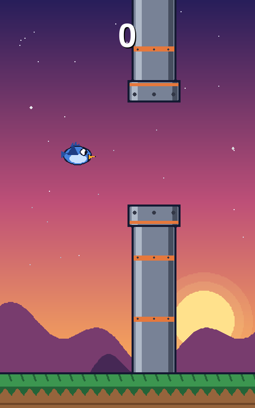
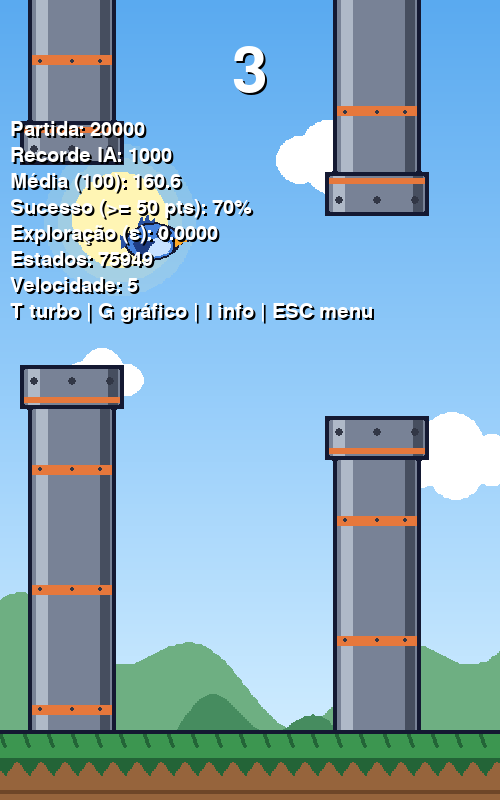
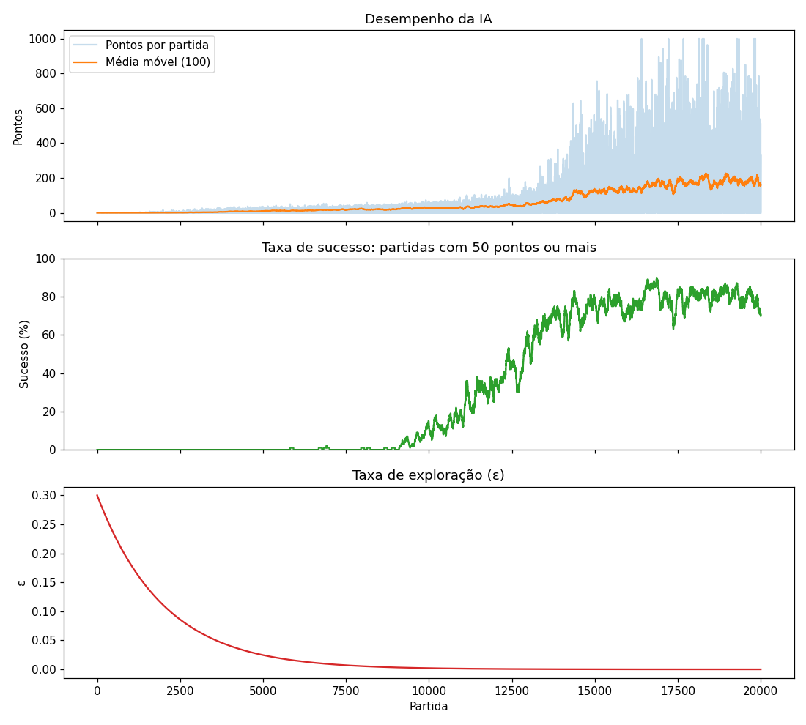

# Flappy Bird com IA que aprende a jogar (Q-Learning)

Jogo no estilo Flappy Bird feito em Python com Pygame, com dois modos: um em que
a pessoa joga e outro em que o pássaro aprende a jogar sozinho, errando,
sendo punido pelos erros e melhorando partida após partida.

| Modo jogador | Modo IA (depois de 20 mil partidas de treino) |
|---|---|
|  |  |

## Sobre o projeto

Este é um **trabalho de estágio**. A proposta era desenvolver um jogo a partir
de uma lista de sugestões, e o escolhido foi o Flappy Bird, com cinco
funcionalidades obrigatórias (subir ao clicar, gravidade, geração automática de
obstáculos, detecção de colisão e contador de pontos).

Junto com o estágio, o projeto foi integrado à cadeira de **Machine Learning
(Aprendizado de Máquina)**: além de jogável, o jogo tem um **modo IA** em que o
pássaro aprende por **aprendizado por reforço**, usando o algoritmo
**Q-Learning**. Ninguém ensina a ele quando pular; ele descobre sozinho,
pontuando e errando, até jogar melhor que muita gente.

**Equipe:** Pedro Arthur, Leone, Davi Marques, Paulo.

---

## Sumário

1. [Requisitos mínimos](#requisitos-mínimos)
2. [Instalação](#instalação)
3. [Como jogar](#como-jogar)
4. [Funcionalidades exigidas](#funcionalidades-exigidas)
5. [Como a IA aprende](#como-a-ia-aprende-machine-learning)
6. [Medições de desempenho](#medições-de-desempenho)
7. [Resultados](#resultados)
8. [Solução de problemas](#solução-de-problemas)
9. [Configuração e dependências](#configuração-e-dependências)
10. [Estrutura do projeto](#estrutura-do-projeto)
11. [Histórico de versões](#histórico-de-versões)
12. [Créditos e próximos passos](#créditos-e-próximos-passos)

---

## Requisitos mínimos

| Item | Mínimo | Recomendado |
|---|---|---|
| Sistema | Windows 10, Linux ou macOS | Windows 10/11 64 bits |
| Python | 3.10 | **3.12** |
| pygame | 2.1 (obrigatório) | 2.6.1 |
| matplotlib | 3.5 (opcional, só para gráficos) | a mais recente |
| Tela | janela de 500 x 800 pixels | resolução vertical de 900 px ou mais |
| Memória | 200 MB livres | - |
| Disco | 50 MB (dependências) + até 5 MB (treino da IA) | - |

### Versões do Python testadas

| Python | Resultado | Observação |
|---|---|---|
| 3.9 ou anterior | não suportado | O jogo avisa e encerra |
| 3.10 | funciona | pygame 2.6.1 + matplotlib 3.10 |
| 3.11 | funciona | pygame 2.6.1 + matplotlib 3.11 |
| **3.12** | **funciona (recomendado)** | Versão usada no desenvolvimento |
| 3.13 | funciona | pygame 2.6.1 + matplotlib 3.11 |
| 3.14 ou mais novo | funciona com **pygame-ce** | O pygame oficial não tem instalador para essas versões; o `requirements.txt` instala o pygame-ce automaticamente |

---

## Instalação

### 1. Instalar o Python (se ainda não tiver)

No PowerShell:

    winget install Python.Python.3.12

Ou pelo site python.org/downloads. **Na primeira tela do instalador, marque
"Add python.exe to PATH".** Depois, feche e abra o terminal de novo.

Confira:

    python --version

### 2. Baixar o projeto

    git clone https://github.com/pxdroarth/flappy-bird-estagio-ML-Q-Learning.git
    cd flappy-bird-estagio-ML-Q-Learning

Ou baixe o ZIP pelo botão **Code > Download ZIP** e extraia.

### 3. (Opcional, recomendado) Criar um ambiente virtual

Isola as bibliotecas do projeto das do resto do computador:

    python -m venv .venv
    .venv\Scripts\activate

No Linux/macOS: `source .venv/bin/activate`.

### 4. Instalar as dependências

    python -m pip install -r requirements.txt

### 5. Verificar o ambiente

    python ferramentas/verificar_ambiente.py

O script confere a versão do Python, as bibliotecas, as imagens e a permissão
de escrita, e diz como resolver cada problema encontrado.

### 6. Rodar

    python main.py

Para treinar a IA sem abrir janela (bem mais rápido):

    python main.py --treinar 20000

---

## Como jogar

| Tela | Tecla | Ação |
|---|---|---|
| Menu | `1` | Jogar |
| Menu | `2` | Ver a IA aprender |
| Menu | `ESC` | Sair |
| Jogar | `ESPAÇO`, seta pra cima ou clique | Voar |
| Jogar | `ESC` | Voltar ao menu |
| IA | `T` | Turbo: treina várias partidas sem desenhar cada frame |
| IA | `G` | Gráficos de desempenho (o jogo pausa até fechar o gráfico) |
| IA | `I` | Mostrar/esconder as medições |
| IA | `ESC` | Salvar o aprendizado e voltar ao menu |

No modo jogador, a cada 10 pontos as colunas ficam mais rápidas (até o limite
de velocidade 10). O recorde fica salvo. O fundo passa por **dia, tarde e
noite** com o tempo, com transição suave entre eles.

---

## Funcionalidades exigidas

| Funcionalidade | Onde está no código |
|---|---|
| F1 - Subir ao clicar/tocar | `Passaro.pular()` em `jogo/entidades.py` e `ler_comando_jogador()` em `jogo/telas.py` |
| F2 - Gravidade | `Passaro.mover()` em `jogo/entidades.py` |
| F3 - Gerar obstáculos automaticamente | `Jogo.atualizar_colunas()` em `jogo/mundo.py` |
| F4 - Colisão com obstáculo ou chão | `Jogo.verificar_colisao()` em `jogo/mundo.py` |
| F5 - Contador de pontos | `Jogo.atualizar_colunas()` em `jogo/mundo.py` |

---

## Como a IA aprende (Machine Learning)

### Aprendizado por reforço

No aprendizado por reforço existe um **agente** (o pássaro) que vive num
**ambiente** (o jogo). A cada momento o agente observa a situação (o
**estado**), escolhe uma **ação** e recebe uma **recompensa** ou uma
**punição**. Ninguém diz qual é a ação certa: o agente aprende por tentativa e
erro quais ações, em cada situação, levam a mais recompensa no longo prazo.

```
        estado (onde estou?)
   ┌────────────────────────────┐
   │                            ▼
 JOGO                        PÁSSARO
   ▲                            │
   └────────────────────────────┘
      ação (pular ou não pular)
   + recompensa (+1 vivo, -1000 bateu)
```

### O estado: o que o pássaro "enxerga"

O pássaro não vê a tela. A cada frame, a situação é resumida em 4 números
(`AgenteQLearning.obter_estado()` em `ia/agente.py`):

| Informação | Como é calculada | Por quê |
|---|---|---|
| Distância até a coluna | Frames que faltam para passar a coluna, em blocos de 3 | Medir em frames (e não em pixels) faz o aprendizado valer em qualquer velocidade |
| Altura em relação ao vão | Distância entre a parte de baixo do pássaro e a base do vão, em blocos de 10 px | Diz se ele está alto ou baixo demais |
| Velocidade vertical | Velocidade atual (negativa = subindo) | O mesmo lugar exige ações diferentes subindo ou caindo |
| Diferença para a coluna seguinte | Diferença de altura entre a próxima coluna e a seguinte, em blocos de 60 px | Permite se preparar para subir ou descer antes de sair do vão |

Agrupar valores em blocos (**discretização**) é o que torna o problema
aprendível com uma tabela: em vez de infinitas posições, existem algumas
dezenas de milhares de situações diferentes.

### As ações

Só duas: **0 = não pular** e **1 = pular**.

### As recompensas

| Situação | Recompensa |
|---|---|
| Cada frame vivo | +1 |
| Os 2 últimos frames antes de bater | -1000 |
| O último pulo, se bateu por cima (coluna de cima ou teto) | -1000 |

Não é preciso recompensar os pontos diretamente: quem sobrevive mais passa por
mais colunas. A punição forte ensina o que **não** fazer.

### A tabela Q

A tabela Q é a "memória" do pássaro. Cada linha é um estado e guarda uma nota
para cada ação: quanto de recompensa ele espera ganhar dali para frente se
fizer aquela ação.

| Estado (distância, altura, velocidade, seguinte) | Q(não pular) | Q(pular) | Decisão |
|---|---|---|---|
| `12, -3, 4, 1` | 187,4 | -412,0 | não pular |
| `2, 1, 9, 0` | -950,2 | 63,8 | pular |

*(valores ilustrativos)*

No começo todas as notas são 0. Na hora de jogar, o pássaro olha a linha do
estado atual e escolhe a ação com a maior nota. A tabela é salva em
`dados/tabela_q.json` e continua de onde parou na próxima execução.

### A fórmula de atualização

Depois de cada partida, cada nota usada é corrigida com a equação do
Q-Learning:

```
Q(s, a) ← Q(s, a) + α · [ r + γ · max Q(s', a') − Q(s, a) ]
```

| Símbolo | Significado |
|---|---|
| `Q(s, a)` | Nota atual da ação `a` no estado `s` |
| `r` | Recompensa recebida (+1 ou -1000) |
| `s'` | Estado seguinte |
| `max Q(s', a')` | Melhor nota possível no estado seguinte (o futuro) |
| `α` | Taxa de aprendizado |
| `γ` | Fator de desconto |

Em palavras: a nova nota é a antiga, corrigida na direção de "o que eu ganhei
agora + o melhor que ainda posso ganhar depois". No frame da batida não existe
futuro, então o alvo é só a recompensa (-1000).

**Aprendizado de trás pra frente:** no fim de cada partida, a tabela é
atualizada do último frame para o primeiro. Assim a punição da batida chega
logo aos frames que a causaram, em vez de levar centenas de partidas para
"descer" frame a frame.

### Os parâmetros

Ficam no topo de `ia/agente.py`:

| Parâmetro | Valor | O que faz |
|---|---|---|
| `α` (taxa de aprendizado) | **0,7** | Quanto cada experiência nova muda a nota antiga. Alto = aprende rápido; como o jogo é quase determinístico, dá para confiar bastante no que acabou de acontecer |
| `γ` (fator de desconto) | **1,0** | Quanto o futuro pesa. Em 1,0, sobreviver lá na frente vale tanto quanto agora |
| `ε` inicial (taxa de exploração) | **0,3** | Chance de fazer uma ação aleatória em vez da melhor conhecida |
| Decaimento de `ε` | **0,9995 por partida** | `ε = ε × 0,9995` a cada partida: cerca de 0,025 em 5 mil partidas e 0,002 em 10 mil |
| `ε` mínimo | **0** | No fim ele só usa o que aprendeu |
| Recompensas | +1 / -1000 | Constantes `RECOMPENSA_VIVO` e `RECOMPENSA_MORTE` |

### Exploração vs. aproveitamento

Se o pássaro sempre fizer o que já acha melhor (**aproveitamento**), pode
nunca descobrir algo melhor. Se agir ao acaso demais (**exploração**), não usa
o que aprendeu. A estratégia **ε-greedy** equilibra os dois: com chance `ε`
ele faz uma ação aleatória, senão faz a melhor conhecida. Como `ε` diminui a
cada partida, ele explora muito no começo e quase nada no fim.

Nas ações aleatórias, ele pula só 10% das vezes: pular a esmo quase sempre o
leva ao teto, e a exploração seria desperdiçada.

O `ε` mínimo é 0 (e não 0,01, por exemplo) porque uma partida boa dura dezenas
de milhares de frames: mesmo 1% de decisões aleatórias bastaria para derrubá-lo
no meio de uma partida longa.

---

## Medições de desempenho

### Na tela (modo IA)

| Medição | O que mostra |
|---|---|
| Partida | Quantas partidas ele já jogou, somando todas as execuções |
| Recorde IA | Maior pontuação que ele já fez |
| Média (100) | Média de pontos das últimas 100 partidas |
| Sucesso (>= 50 pts) | **Taxa de desempenho**: % das últimas 100 partidas que chegaram a 50 pontos |
| Exploração (ε) | Taxa de exploração atual |
| Estados | Quantas situações diferentes ele já conhece (linhas da tabela Q) |
| Velocidade | Velocidade atual das colunas |

A meta de sucesso pode ser mudada em `META_SUCESSO`, no arquivo `jogo/config.py`.

### Gráficos

A tecla `G` no modo IA abre três gráficos, com todo o histórico de treino:



1. **Desempenho:** pontos por partida e média móvel.
2. **Taxa de sucesso:** % das partidas que chegaram à meta.
3. **Taxa de exploração (ε):** caindo ao longo das partidas.

Dá para ver a relação entre eles: enquanto a exploração é alta, o sucesso fica
perto de 0. Quando ela cai e a tabela já conhece as situações importantes, o
sucesso sobe rápido e estabiliza em torno de 75 a 85%.

Ao treinar com `--treinar`, o gráfico também é salvo em `dados/grafico_treino.png`.

---

## Resultados

Todos com 20 mil partidas de treino, começando do zero. Cada linha é uma
execução; o jogo tem sorteio de colunas, então repetir o treino dá números um
pouco diferentes.

### Evolução por versão

| Versão | Mudança | Média final | Recorde |
|---|---|---|---|
| v3 | Estado com 3 informações | 51,4 | 256 |
| v4 | + diferença para a coluna seguinte | 142,3 | 1000* |
| v5 | + exploração de 0,3 com decaimento | **178,7** | 1000* |

\* 1000 é o limite de pontos por partida no treino (`LIMITE_PONTOS` em
`ia/treino.py`), que existe só para o treino não rodar para sempre.

### Teste da taxa de exploração

Mesmo código, mudando só o `ε` inicial:

| ε inicial | Média final | Sucesso final | Recorde |
|---|---|---|---|
| 0 (sem exploração) | 109,5 | 64,8% | 932 |
| 0,1 | 86,0 | 70,8% | 660 |
| **0,3** | **178,7** | **74,4%** | **1000** |

### O limite da tabela Q

A IA fica muito boa, mas não perfeita. Como o estado agrupa valores em blocos,
duas situações um pouco diferentes podem cair na mesma linha da tabela e
exigir ações diferentes. Para ir além, seria preciso uma rede neural (Deep
Q-Learning), que generaliza entre situações parecidas.

---

## Solução de problemas

Rode primeiro `python ferramentas/verificar_ambiente.py`: ele detecta a
maioria dos problemas abaixo e diz como resolver.

| Sintoma | Causa | Solução |
|---|---|---|
| `python` não é reconhecido, ou abre a Microsoft Store | Python não instalado ou fora do PATH | Instale com `winget install Python.Python.3.12` ou pelo python.org marcando **Add python.exe to PATH**. Reabra o terminal. Se ainda abrir a Store: Configurações > Aplicativos > Configurações avançadas de aplicativos > Aliases de execução, e desligue os de `python.exe` |
| `pip` não é reconhecido | pip fora do PATH | Use sempre `python -m pip ...` |
| `Get-Process: Não é possível localizar um parâmetro posicional` | O texto `PS C:\...>` foi colado junto com o comando | Copie só o comando, sem o prompt |
| O PowerShell mostra `>>` e não executa | Várias linhas coladas de uma vez | Aperte `Ctrl+C` e rode um comando por vez |
| Erro ao instalar pygame: `Failed building wheel`, `SDL not found` | Python 3.14+ com o pygame oficial, que não tem instalador para essas versões | Use o `requirements.txt` deste projeto (instala o pygame-ce) ou o Python 3.12 |
| `ModuleNotFoundError: No module named 'pygame'` | Dependências instaladas em outro Python (vários Pythons, ou ambiente virtual não ativado) | Ative o ambiente virtual e rode `python -m pip install -r requirements.txt` com o mesmo `python` que roda o jogo. `py -0` lista os Pythons instalados |
| Verificador acusa pygame **e** pygame-ce juntos | Os dois usam o mesmo `import pygame` e brigam | `python -m pip uninstall -y pygame pygame-ce` e depois `python -m pip install -r requirements.txt` |
| `.venv\Scripts\activate` bloqueado: "a execução de scripts foi desabilitada" | Política de execução do PowerShell | `Set-ExecutionPolicy -Scope Process Bypass` (vale só para aquela janela) |
| "Python ... é antigo demais" | Python 3.9 ou anterior | Instale o Python 3.12 |
| "Imagens não encontradas" | Pasta `assets/imagens` incompleta | `python ferramentas/gerar_imagens.py` |
| O terminal fica parado depois de `python main.py` | É normal: o jogo abre numa janela separada | Procure a janela "Flappy Bird" na barra de tarefas ou com `Alt+Tab` |
| As teclas não respondem | O foco está no terminal | Clique dentro da janela do jogo |
| O jogo congela no modo IA | A tecla `G` abriu o gráfico, que pausa o jogo | Feche a janela do gráfico (às vezes ela abre atrás do jogo) |
| A janela aparece cortada | Tela com menos de 800 px de altura útil (notebooks com escala de 125% ou mais) | Em Configurações > Sistema > Tela, reduza a escala para 100% |
| "Tabela Q ignorada porque é de uma versão anterior" | A tabela foi treinada com outro formato de estado | Normal ao atualizar: a IA recomeça do zero e a antiga fica salva como `.antigo` |
| O recorde ou o treino não são salvos | Sem permissão de escrita (ex.: projeto dentro de `Arquivos de Programas`) | Mova o projeto para a Área de Trabalho ou Documentos |
| Parei o treino com `Ctrl+C` | - | O treino é salvo a cada 1000 partidas; na próxima vez ele continua dali |

---

## Configuração e dependências

### Dependências diretas

| Pacote | Uso | Obrigatório | Versão aceita |
|---|---|---|---|
| `pygame` | Janela, desenho, teclado, colisão | Sim (Python até 3.13) | `>=2.1,<3` |
| `pygame-ce` | Substituto do pygame, mesmo `import pygame` | Sim (Python 3.14+) | `>=2.5,<3` |
| `matplotlib` | Gráficos de desempenho da IA | Não | `>=3.5` |

O resto do código usa só a biblioteca padrão do Python (`json`, `os`,
`random`, `math`, `collections`, `sys`).

O `matplotlib` traz dependências indiretas: `numpy`, `pillow`, `contourpy`,
`cycler`, `fonttools`, `kiwisolver`, `packaging`, `pyparsing`,
`python-dateutil` e `six`. O pip escolhe sozinho as versões compatíveis com o
seu Python (o `numpy` mais recente, por exemplo, exige Python 3.12, e no 3.10
o pip instala uma versão anterior).

### Política de versões

- **Limite inferior** em todas as dependências: evita versões antigas sem os
  recursos usados.
- **Limite superior** no pygame (`<3`): uma versão 3 poderia mudar a API e
  quebrar o jogo sem aviso.
- **Marcadores de ambiente** (`; python_version < "3.14"`): o mesmo
  `requirements.txt` instala o pygame certo para cada versão do Python, sem o
  usuário precisar escolher.
- **Degradação suave:** sem o matplotlib o jogo roda normalmente e só os
  gráficos ficam indisponíveis. Sem as imagens, ele desenha formas simples.
- **Verificação no início:** o `main.py` confere a versão do Python e se o
  pygame está instalado antes de começar, com uma mensagem explicando o que
  fazer.

### Configuração do jogo

Todas as constantes ficam em `jogo/config.py` (tamanho da tela, física,
dificuldade, duração do dia e da noite, meta de sucesso, pastas). Os
parâmetros da IA ficam no topo de `ia/agente.py`.

### O que é versionado e o que não é

| Versionado no Git | Fora do Git (`.gitignore`) |
|---|---|
| Código, imagens, `requirements.txt`, documentação | `dados/*.json` (tabela Q), `dados/*.txt` (recorde), `dados/*.png` (gráfico do treino) |
| `dados/.gitkeep` (mantém a pasta) | `.venv/`, `__pycache__/` |

A tabela Q não é versionada porque é gerada pelo treino, muda a cada partida e
chega a alguns MB.

### Compatibilidade da tabela Q

O arquivo da tabela guarda um número de **formato** (`FORMATO_TABELA` em
`ia/agente.py`). Quando o formato do estado muda (como na v4, que passou de 3
para 4 informações), uma tabela antiga não serve mais. Nesse caso o jogo
guarda a antiga como `tabela_q.json.antigo` e começa um treino novo, em vez de
carregar dados sem sentido.

---

## Estrutura do projeto

    flappy-bird/
    ├── main.py                     ponto de entrada (menu ou --treinar)
    ├── requirements.txt            dependências
    ├── assets/imagens/             imagens do jogo (geradas por código)
    ├── docs/                       imagens deste README
    ├── ferramentas/
    │   ├── gerar_imagens.py        desenha todas as imagens em pixel art
    │   └── verificar_ambiente.py   diagnóstico da instalação
    ├── jogo/
    │   ├── config.py               todas as configurações
    │   ├── imagens.py              carrega as imagens
    │   ├── entidades.py            Passaro e Coluna
    │   ├── mundo.py                regras: movimento, colisão, pontos
    │   ├── ciclo.py                ciclo de dia, tarde e noite
    │   └── telas.py                menu, modo jogador e modo IA
    ├── ia/
    │   ├── agente.py               AgenteQLearning: estado, ações, tabela Q, parâmetros
    │   ├── treino.py               partidas da IA e treino sem janela
    │   └── graficos.py             gráficos de desempenho
    └── dados/                      recorde, tabela Q e gráfico (gerados, fora do Git)

A regra do jogo (`jogo/mundo.py`) não sabe nada de teclado nem de IA: a cada
frame ela só recebe "pula ou não pula". O modo jogador manda o comando do
teclado e a IA manda o comando da tabela Q, então os dois jogam com exatamente
as mesmas regras.

### Imagens

Todas as imagens são desenhadas por código em `ferramentas/gerar_imagens.py`
(pássaro azul com topete, colunas de metal, chão e três céus). Para mudar o
visual, edite as cores em `PALETA` e `TEMAS_FUNDO` e rode o script de novo.

---

## Histórico de versões

Cada versão tem uma tag no repositório (`v1`, `v2`...). Para ver o projeto
como estava, escolha a tag no seletor de branch do GitHub.

| Versão | O que mudou |
|---|---|
| **v1** | Jogo em arquivo único, com modo jogador e modo IA (Q-Learning) |
| **v2** | Código separado em módulos (`jogo/`, `ia/`) e imagens próprias geradas por código |
| **v3** | Ciclo de dia, tarde e noite no fundo |
| **v4** | IA enxerga a coluna seguinte: média de 51 para 142 pontos |
| **v5** | Exploração com decaimento, medições de desempenho e gráficos, requisitos testados, verificador de ambiente e este README |

---

## Créditos e próximos passos

A parte de Q-Learning partiu do projeto de Stalone Augusto
([FlappyBirdQLearning](https://github.com/HardWareGCR/FlappyBirdQLearning-01656165-StaloneAugusto)),
que relata recorde entre 15 e 30 pontos. Em relação a ele, este projeto
adicionou o modo jogador e corrigiu o aprendizado: no original, a punição da
batida nunca chegava à tabela Q, porque a atualização era pulada no frame da
morte.

Próximos passos possíveis:
- **Deep Q-Learning:** trocar a tabela por uma rede neural.
- **Mais informações no estado:** por exemplo, a velocidade das colunas.
- **Comparar parâmetros automaticamente:** rodar vários treinos com valores
  diferentes de `α`, `γ` e `ε` e comparar os gráficos.
